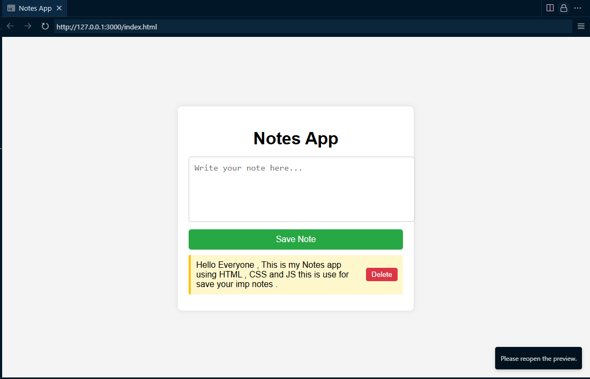

# Notes App 📝

A simple and lightweight Notes App built using **HTML**, **CSS**, and **JavaScript**.

## 📌 Features

- Write and save notes
- Notes stored in browser using `localStorage`
- Delete individual notes
- Responsive & clean design

## 🖥️ Screenshot




## 🚀 How to Use

1. Clone the repository:
   ```bash
   git clone https://github.com/Krishna-Gupta989/simple-notes-app.git

